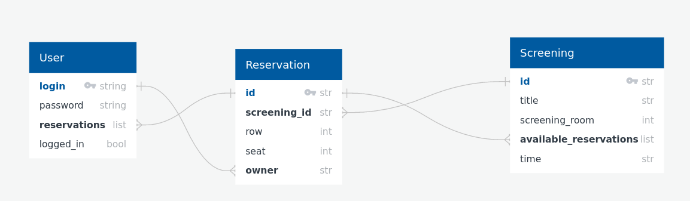

# Project report

Wojciech Wieczorek 145465

## Database diagram


```python
from IPython.display import Image
Image(filename='diagram.png')
```


    

    


## Description

Starting system clean creates 3 movie screenings with empty seats ready to occupy by the users.

You can create users by following something that resembles dialog window in terminal the app is running in.

Created users have two acctions: logging in (and out) and reserving unoccupied seats.

Users keep all their reservations in a list. You cannot be logged in onto one user in more than one terminal. Login has to be unique.

One reservation is equivalent to one seat at one screening. Reservation's 'owner' attribute is equal to None if seat is empty, otherwise is equal to owners login.

Each screening (Moveie at given time in given place) keeps its available seats as a list. If length of that list equals 0 - it means no user can make a reservation on that screening.

## Stress tests

There exist a possibility of running 3 kinds of stress tests on cinema system. They can be started by running the app with proper flag. If stress test is conducted, it will initiate new state of the system and app will shut down after it's done (if no errors encountered).

### Stress test 1

Run by executing:

```
python main.py --stress-test-1
```

One user is created, then they randomly select movie screening and seat at the selected screening's room. That repeats 1000 times (value is hard coded and can be easly changed - its parameter <code>actions</code> of function <code>test_1()</code>) or until there are no more seats at any screening.

Model encountered no problems during this stress test.

### Stress test 2

Run by executing:

```
python main.py --stress-test-2
```

Two users are created, then they select randomly one of two available actions: log out - log in or make a reservation. Action selection repeats 1000 times for each (value is hard coded and can be easly changed - its parameter <code>actions</code> of function <code>test_2()</code>). Each user runs on seperate independent thread.

Model encountered no problems during this stress test.

### Stress test 3

Run by executing:

```
python main.py --stress-test-3
```

One user is created, then they atempt to make a reservation on every yet unoccupied seat. Action repeats until there are no more empty seats at any screening.

Model encountered no problems during this stress test.

## Problems encountered

Sometimes untracable riak error occures, but it is certainly caused by docker/docker-compose.

It usually disapears after running:
```
$ sudo docker-compose down
$ sudo docker-compose up -d coordinator
$ sudo docker-compose scale member=4
```


```python

```
